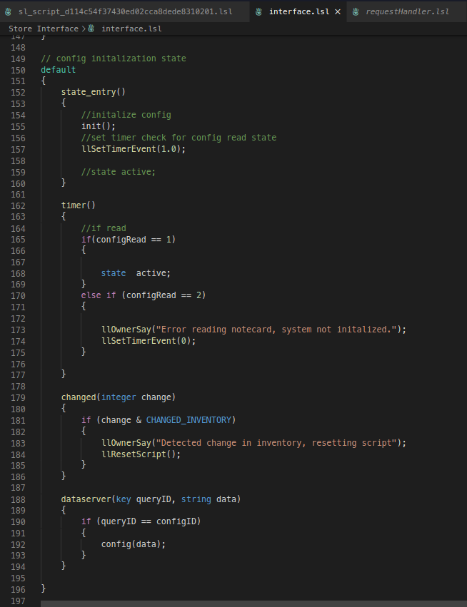

# lsl-FS README

Basic snippets and syntax for LSL and Firestorm enabled features.

## Features

Makes use of [Makopo's Sublime Syntax](https://github.com/Makopo/sublime-text-lsl) converted for use in VSCode.

Updates and reworks snippets used in [LSL-FP](https://marketplace.visualstudio.com/itemdetails?itemName=DalGhost.lsl-fp).

## Release Notes

Initial release.

## Future plans

Create a proper Language Server Protocol for LSL to properly implement intellisense.

## Patch Notes

### 0.1.0

* Basic syntax converted from [Makopo's Sublime Syntax](https://github.com/Makopo/sublime-text-lsl)
* Updates snippets from [LSL-FP](https://marketplace.visualstudio.com/itemdetails?itemName=DalGhost.lsl-fp)
* Reworks snippets from [LSL-FP](https://marketplace.visualstudio.com/itemdetails?itemName=DalGhost.lsl-fp)
